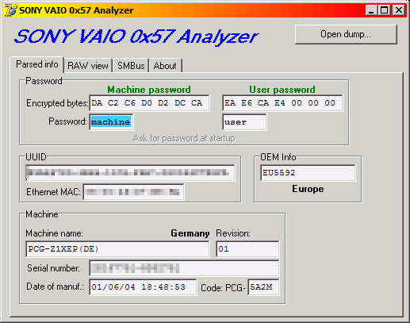

SONY VAIO Analyzer
==================

Reads the BIOS settings from the EEPROM located at SMBus address 0x57 from
Sony VAIO notebooks and displays them.

The SMBus devices it's compatible with are defined in `SMBus.pas`. You could
try to add your own if it's missing.

This application uses ZLPortIO by Alexander Zloba.

[More info about SVA.](http://wiki.mbirth.de/know-how/hacking/bios-password/sony-vaio.html)

